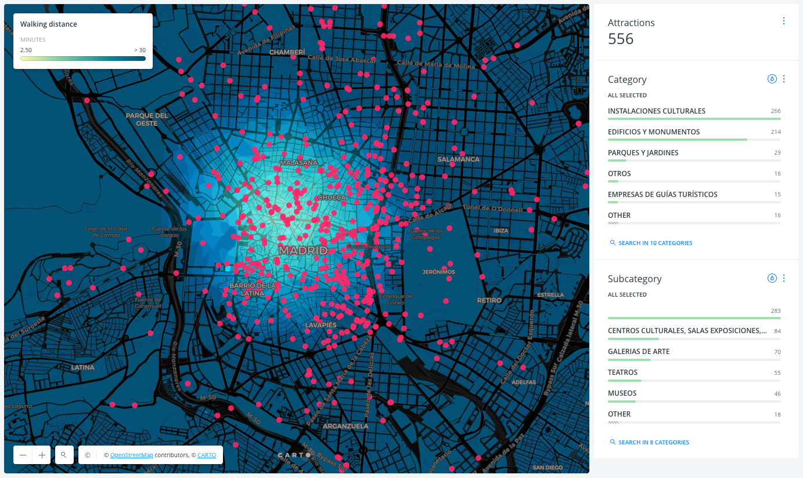

# CARTO office

Welcome!

I hope you like our office :) Take a seat and let's talk a bit about what we do here. 

[Slides.](https://docs.google.com/presentation/d/12DZJUFARs8phKZI6wdw4ua4uCXvPJl5NNyvSmFopXQs/edit?usp=sharing)

[Here is map](https://team.carto.com/u/abel/builder/570d1084-e174-11e6-a8b5-0e3ff518bd15/embed?state=%7B%22map%22%3A%7B%22ne%22%3A%5B40.391600154151%2C-3.7477970123291016%5D%2C%22sw%22%3A%5B40.444530259240274%2C-3.661279678344727%5D%2C%22center%22%3A%5B40.41807041185426%2C-3.7045383453369145%5D%2C%22zoom%22%3A14%7D%7D) with things to go see in Madrid, by walking time from here!

and few more examples of how CARTO is being used to learn about our cities:

- [Informo Madrid](http://informo.munimadrid.es/#/realtime?panel=live)
- [Traffic fines in Madrid](https://demos.carto.io/view_demo?demo_id=5Q9K7MPSJaAesWyUMgEKGm)
- [NYC Crime map](https://maps.nyc.gov/crime/)
- [Traffic accidents and London weather](https://alteryx.carto.com/u/alteryx-admin/builder/22be9480-7057-11e6-8adb-0e05a8b3e3d7/embed?state=%7B%22map%22%3A%7B%22ne%22%3A%5B51.23880388089746%2C-0.8200639486312867%5D%2C%22sw%22%3A%5B51.778982969039674%2C0.5642133951187135%5D%2C%22center%22%3A%5B51.50969400347934%2C-0.12792527675628665%5D%2C%22zoom%22%3A10%7D%2C%22widgets%22%3A%7B%2224db07e9-3c44-4bd4-a835-bd0b6fceb5dd%22%3A%7B%22normalized%22%3Atrue%7D%2C%224449e2b3-21d7-49a2-8051-a87b366ed162%22%3A%7B%22normalized%22%3Atrue%7D%2C%22755b043c-3163-4a46-b192-9b1cc8a78c5e%22%3A%7B%22normalized%22%3Atrue%7D%2C%228ae50bbf-d17a-4b4d-848c-8f589afd0790%22%3A%7B%22normalized%22%3Atrue%7D%2C%221dbfb38d-eba6-445a-b3c5-c83f5d728828%22%3A%7B%22normalized%22%3Atrue%7D%2C%225976e7eb-6edf-430f-a2da-0a2b3a385df7%22%3A%7B%22normalized%22%3Atrue%7D%7D%7D)
- [Madrid trash's map](https://team.carto.com/u/abel/builder/6e057560-cc52-49ea-84bd-cdcf9865fedf/embed?state=%7B%22map%22%3A%7B%22ne%22%3A%5B40.36539129429548%2C-3.788844868540764%5D%2C%22sw%22%3A%5B40.4711204856492%2C-3.6158102005720143%5D%2C%22center%22%3A%5B40.418276659249024%2C-3.7023275345563893%5D%2C%22zoom%22%3A13%7D%2C%22widgets%22%3A%7B%22f4125a28-dfa1-4139-8b0b-8674669b4954%22%3A%7B%22normalized%22%3Atrue%7D%2C%22292b75d8-fed8-44e9-a983-2d210112a1a0%22%3A%7B%22normalized%22%3Atrue%7D%7D%7D)
- [Bus lines performance in Madrid](https://solutionscdb.carto.com/u/cdbsol-admin/builder/4b5a4090-b17c-11e6-b6f1-0e3ff518bd15/embed?state=%7B%22map%22%3A%7B%22ne%22%3A%5B40.383297460379886%2C-3.782730102539063%5D%2C%22sw%22%3A%5B40.465886539000685%2C-3.609695434570313%5D%2C%22center%22%3A%5B40.42465%2C-3.6962%5D%2C%22zoom%22%3A13%7D%2C%22widgets%22%3A%7B%224d34b018-957f-4bb8-923a-6a56f9b7a09e%22%3A%7B%22normalized%22%3Atrue%7D%2C%22e26faacc-fbde-405d-aac4-dadcb3b05ef5%22%3A%7B%22normalized%22%3Atrue%7D%7D%7D)
- [Cadaster info in Benidorm](https://abel.carto.com/builder/28d1dd06-2d85-11e6-ae20-0ecd1babdde5/embed?state=%7B%22map%22%3A%7B%22ne%22%3A%5B38.52628372162873%2C-0.14006210491061213%5D%2C%22sw%22%3A%5B38.55343966992909%2C-0.09680343791842462%5D%2C%22center%22%3A%5B38.539862977349785%2C-0.11843277141451837%5D%2C%22zoom%22%3A15%7D%2C%22widgets%22%3A%7B%222b60c32f-7959-4278-b1ac-de3614381d67%22%3A%7B%22normalized%22%3Atrue%7D%2C%221e701f3d-ac23-4188-b51e-c02c3ff2abd1%22%3A%7B%22normalized%22%3Atrue%7D%7D%7D)
- [Percentage of population below poverty threshold in NYC](https://abel.carto.com/builder/28d1dd06-2d85-11e6-ae20-0ecd1babdde5/embed?state=%7B%22map%22%3A%7B%22ne%22%3A%5B38.52628372162873%2C-0.14006210491061213%5D%2C%22sw%22%3A%5B38.55343966992909%2C-0.09680343791842462%5D%2C%22center%22%3A%5B38.539862977349785%2C-0.11843277141451837%5D%2C%22zoom%22%3A15%7D%2C%22widgets%22%3A%7B%222b60c32f-7959-4278-b1ac-de3614381d67%22%3A%7B%22normalized%22%3Atrue%7D%2C%221e701f3d-ac23-4188-b51e-c02c3ff2abd1%22%3A%7B%22normalized%22%3Atrue%7D%7D%7D)
- [How New York was built](https://cartodb.github.io/carto-vl-maps/blog/state-of-the-art-styling/manhattan-buildings.html)
- [BBVA Urban Discovery](https://www.bbvadata.com/urbandiscovery/)
- [Atlas of inequality](https://inequality.media.mit.edu/)
- [Global Forest Watch](https://www.globalforestwatch.org/)