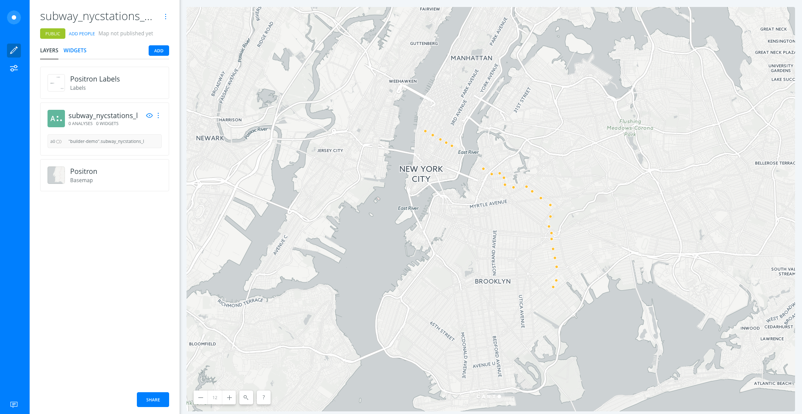
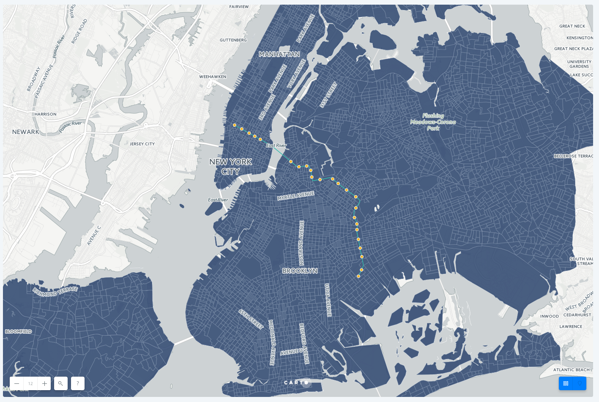
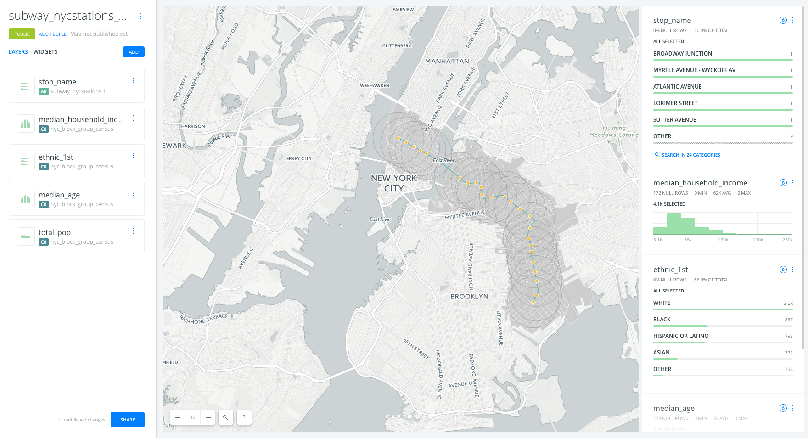
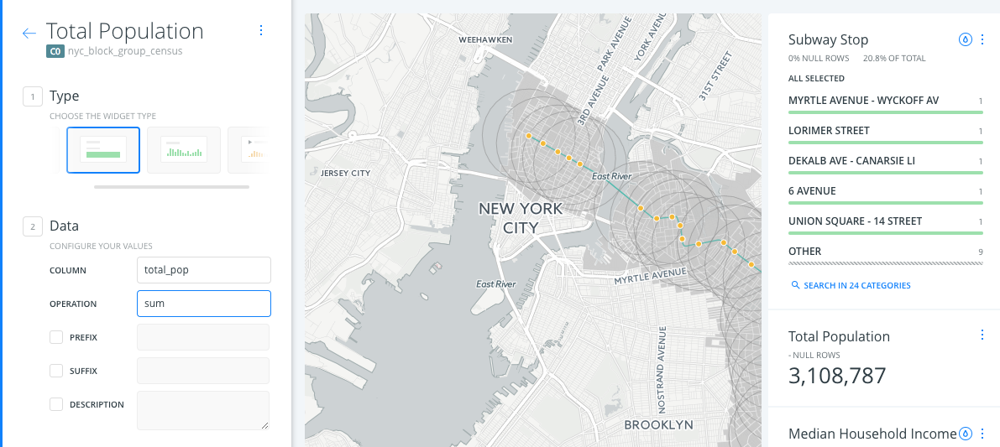

# The closing of the L line and NYC demographics

We will need the following datasets for this exercise:

* [New York subway stations](https://builder-demo.carto.com/api/v2/sql?q=SELECT+*+FROM+subway_nycstations_l&format=gpkg&filename=subway_nycstations_l): `subway_nycstations_l`. 
* [New York subway lines](https://builder-demo.carto.com/api/v2/sql?q=SELECT+*+FROM+nyc_subway_lines&format=gpkg&filename=nyc_subway_lines): `nyc_subway_lines`.
* [New York block group census](https://builder-demo.carto.com/api/v2/sql?q=SELECT+*+FROM+nyc_block_group_census&format=csv&filename=nyc_block_group_census): `nyc_block_group_census`.

### 1. Create a map 

* Click on **`NEW MAP`**.
* Click on **`CONNECT DATASET`**.
* Drag and drop `subway_nycstations_l.gpkg`.
* Click on **`CONNECT DATASET`**.
* Click on `Don't show me this again` to avoid modals.
* You can rename the map title as "The L line and demographics" by double-clicking on it.

### 2. Layers 

* Add new layers:
  * Click on **`ADD`**.
  * Clik on **`UPLOAD`**.
  * Find `nyc_subway_lines.gpkg` on your computre and click on **`UPLOAD DATASET`**.
  * Click on **`ADD LAYER`**.
  * Reapeat the same for `nyc_block_group_census.csv`

* Now, by moving the layers using drag and drop we can change the order in which the layers are being displayed. We move `subway_nycstations_l` to the top and `nyc_subway_lines` in the second position. The layer `nyc_block_group_census` woudl stay at the bottom of the map.

* Click on one of the layers to show its components:
  * **`DATA` tab**: an overview of your table schema, from here you can also add widgets. If you want to have a look at your dataset, click the Data View icon, located on the bottom right of Builder when a map layer is selected.

Take a look at the letter and number the layers card has (`A`, `B` or `C`). This would be very useful for adding widgets and analysis. Depending on the order in which you added your data, your layer letters could be different than the screenshots. In this example, subway stations were layer A, subway lines layer B, and block groups layer C.

### 3. Analysis 

#### 3.1 Filter by column value

* Go to the edit pane.
* Click layer `nyc_subway_lines` and then select the `Analysis` tab. Finally, click on the **`ADD ANALYSIS`** button in order to add the analysis.
* Select **`Filter by column value`** analysis.
* Click on **`ADD ANALYSIS`**.
* Set the parameters as follows:
  * `TARGET COLUMN`: `route_id`.
  * `VALUE`: `L`.
  * `RESULTS`: `show`.
* Now click on **`APPLY`** to see the result of the filtering. This is the L subway line.

#### 3.2 Create Travel/Distance buffer analysis

* We will apply this analysis to the layer `subway_nycstations_l`. Go back to the **LAYERS** pane in Builder's interface and click on **`0 ANALYSES`** under subway_nycstations_l. Click on **`ANALYSIS`**, then on **`ADD ANALYSIS`**.
* Select the *Create Travel/Distance buffer* analysis. Click **`ADD ANALYSIS`**.
* In the **ANALYSIS** tab of the layer, we have three sections:
  * *Your workflow*: Since this is the first analysis we're adding to the `subway_nycstations_l` layer, node *A*, the analysis layer will be named node *A1*.
  * *Create areas of influence*:
    * *BASE LAYER*: Should be the layer `subway_nycstations_l`, node *A* (*A0*).
    * *TYPE*: Distance
    * *UNIT*: mi
    * *RADIUS*: 1
    * *TRACKS*: 1
    * *BOUNDARIES*: Intact
* After clicking *APPLY*, we should see this result: an area of influence of 1 mile around each subway station.

#### 3.3 Intersect and Aggregate analysis

* Go to the edit pane.
* Click layer `nyc_block_group_census` and then select the `Analysis` tab. Finally, click on the `ADD ANALYSIS` button in order to add the analysis.
* Select **`Intersect and aggregate`** analysis.
* In the *ANALYIS* tab of the layer, we have three sections:
  * *Your workflow*: Since this is the first analysis we're adding to the `nyc_block_group_census` layer, node *C*, this analysis layer will be named node *C1*.
  * *Aggregate intersection*:
    * *Base Layer*: By default the base layer would be `nyc_block_group_census`.
    * *Target Layer*: select the result layer of the Area of Influence analysis *A1*
* After clicking *APPLY*, we should see this result:

#### 3.4 Extract source node and reorder layers

Since we used our subway station layer as the input for the buffers analysis, the data appears as polygons. We want the buffers to be underneath the subway lines, and to extract the original subway station points for display.

* From the `subway_stations_l` layer, drag out the buffers sublayer and place it under the `nyc_subway_lines` layer
* This will create a new layer *D*, and you will see the subway stations drawn on top of the AOI and block group layers

### 4. Styling 

* Go to the edit pane, click on the `AOI` layer *D* and select the `STYLE` tab. Set the `Fill` color to a grey with high opacity, and make the stroke grey also.

* Go to the edit pane, click on the `nyc_block_group_census` layer *D* and select the `STYLE` tab. Set the `Fill` color to a grey that blends with the basemap layer.

### 5. Widgets 

* Go to the edit pane and click on the `widgets` tab.
* Click on `ADD WIDGET` button.
  * Under the `CATEGORY` tab, click on the check box of variables `stop_name` and `ethnic_1st`
  * Under the 'HISTOGRAM' tab, click on the check box of variables `median_household_income` and `median_age`
  * Under the 'FORMULA' tab, click on the check box of variable `total_pop`.
* Click on `CONTINUE`

 

#### 5.1 Explore and style data with Widgets

* Click on the tear drop icon inside each widget to see the Auto-style feature.
* Filter the data by interacting with the category and histogram widgets.

#### 5.2 Customize widgets

* Reorder widgets: From `WIDGET` tab, drag and drop them into your preferred order.
* Rename widgets: From `WIDGET` tab, rename each widget by clicking on its three blue dots and selecting the option to `Rename`.
* Formula widget calculation:
  * By default, the formula widget is calculating the average population. However, we want to see the sum of the total population within our map view.
  * Click on the three blue dots in the Total Population widget and select the option to 'Edit'
  * In the `OPERATION` parameter, select `sum`.

  

### 6. Publish 

* Click on **`SHARE`**.
* Set the map's privacy to `LINK` or `PUBLIC`.
* Click on **`PUBLISH`**.
* Now you can share the map:
  * Link: https://team.carto.com/u/builder-demo/builder/144826d6-0982-11e7-bdeb-0e233c30368f/embed
  * iframe: `<iframe width="100%" height="520" frameborder="0" src="https://team.carto.com/u/builder-demo/builder/144826d6-0982-11e7-bdeb-0e233c30368f/embed" allowfullscreen webkitallowfullscreen mozallowfullscreen oallowfullscreen msallowfullscreen></iframe>`

> Remember to update your map every time you make a change. To see those changes refresh your embed, or the web page where your map is hosted.

