# Spatial SQL

In this section you'll have the chance to test some of the most common [PostGIS](http://postgis.net/docs/reference.html) SQL procedures.

***

## Contents

<!-- TOC depthFrom:1 depthTo:6 withLinks:1 updateOnSave:1 orderedList:0 -->

- [Spatial SQL](#spatial-sql)
	- [Contents](#contents)
	- [Set up](#set-up)
	- [PostGIS concepts: `geometry` vs. `geography`](#postgis-concepts-geometry-vs-geography)
	- [`the_geom` vs. `the_geom_webmercator`](#thegeom-vs-thegeomwebmercator)
	- [SQL that applies to all geometries](#sql-that-applies-to-all-geometries)
		- [Transforming geometries into a different projection](#transforming-geometries-into-a-different-projection)
			- [World Robinson](#world-robinson)
		- [Translating Geometries](#translating-geometries)
		- [Buffer (ST_Buffer)](#buffer-stbuffer)
			- [Simple Buffer](#simple-buffer)
			- [Dissolve Buffers](#dissolve-buffers)
	- [SQL for Points](#sql-for-points)
		- [Know wether a geometry is **within** the given range from another geometry:](#know-wether-a-geometry-is-within-the-given-range-from-another-geometry)
		- [Making lines<a name="lines"></a>](#making-linesa-namelinesa)
			- [Simple lines](#simple-lines)
			- [Multiple lines](#multiple-lines)
			- [Sequential lines](#sequential-lines)
			- [Great Circles (curved lines)](#great-circles-curved-lines)
	- [SQL for Polygons](#sql-for-polygons)
		- [Get the number of points inside a polygon](#get-the-number-of-points-inside-a-polygon)
		- [Get the **difference** between two geometries:](#get-the-difference-between-two-geometries)
		- [Negative buffer](#negative-buffer)
		- [Spatial Joins](#spatial-joins)
	- [SQL for CARTO](#sql-for-carto)
		- [CDB_LatLng()](#cdblatlng)
		- [Grids](#grids)
			- [Hexagon Grids](#hexagon-grids)
			- [Rectangular Grids](#rectangular-grids)

<!-- /TOC -->

***

## Set up

For this exercise, we will use [CARTO](https://carto.com) as a convenient way to interact with PostGIS, which will require no installation or configuration by you. You won't even need an account; we're using public demo datasets. However, you could always download the datasets and import them to your own CARTO account before starting.


These are the datasets that you will need to complete the exercises. You can download them from the links below and import them to your CARTO account. 

* [ne_10m_populated_places_simple](http://carto-workshops.carto.com/api/v2/sql?q=SELECT+*+FROM+ne_10m_populated_places_simple&format=gpkg&filename=ne_10m_populated_places_simple): Populated places in the world.
* [ne_110m_admin_0_countries](http://carto-workshops.carto.com/api/v2/sql?q=SELECT+*+FROM+ne_110m_admin_0_countries&format=gpkg&filename=ne_110m_admin_0_countries): Countries
* [railroad_data](http://carto-workshops.carto.com/api/v2/sql?q=SELECT+*+FROM+railroad_data&format=gpkg&filename=railroad_data): Raiload accidents in the US
* [barcelona_building_footprints](http://carto-workshops.carto.com/api/v2/sql?q=SELECT+*+FROM+barcelona_building_footprints&format=gpkg&filename=barcelona_building_footprints): City blocks in Barcelona
* [lineas_madrid](http://carto-workshops.carto.com/api/v2/sql?q=SELECT+*+FROM+lineas_madrid&format=gpkg&filename=lineas_madrid): Madrid's Metro lines
* [listings_madrid](http://carto-workshops.carto.com/api/v2/sql?q=SELECT+*+FROM+listings_madrid&format=gpkg&filename=listings_madrid): AirBnB data for Madrid

As a client for this workshop, we will use [a very simple custom web app](https://bl.ocks.org/rochoa/raw/4e67ec932e8bb6b17831e0f4a2e0e55d/) that can interact with CARTO.

From the side menu, navigate to 'CARTO', then use the following parameters to connect:

* Maps API endpoint: `https://carto-workshops.carto.com` (or your own username)
* API key: you can leave this empty

Once connected, you can run `SELECT` queries against any public dataset from that account.

Some tables you have available to you from this account are:

* `ne_10m_populated_places_simple`: Natural Earth populated places
* `ne_110m_admin_0_countries`: Natural Earth country boundaries
* `railroad_data`: Railroad accidents in the USA
* `barcelona_building_footprints`: Barcelona blocks
* `lineas_madrid`: Madrid metro lines
* `listings_madrid`: Madrid Airbnb listings

Try entering a simple query like the one below. To run the query, type `Control+Enter` on PCs, `Command+Enter`/`Cmd+Return` on macs, or press the green `play` button in the bottom right corner of the SQL panel. 

```sql
select *
  from listings_madrid
where bathrooms >= 3
```

After applying a query, you should see the results in the map. If it becomes unresponsive, normally just refreshing the page will make it work again.

***

## PostGIS concepts: `geometry` vs. `geography`

* **`Geometry`** uses a cartesian plane to measure and store features (CRS units):

    >The basis for the PostGIS `geometry` type is a plane. The shortest path between two points on the plane is a straight line. That means calculations on geometries (areas, distances, lengths, intersections, etc) can be calculated using cartesian mathematics and straight line vectors.

* **`Geography`** uses a sphere to measure and store features (Meters):

    >The basis for the PostGIS `geography` type is a sphere. The shortest path between two points on the sphere is a great circle arc. That means that calculations on geographies (areas, distances, lengths, intersections, etc) must be calculated on the sphere, using more complicated mathematics. For more accurate measurements, the calculations must take the actual spheroidal shape of the world into account, and the mathematics becomes very complicated indeed.

More about the `geography` type can be found [here](http://workshops.boundlessgeo.com/postgis-intro/geography.html) and [here](http://postgis.net/docs/manual-1.5/ch04.html#PostGIS_Geography).


_Source: [Boundless Postgis intro](http://workshops.boundlessgeo.com/postgis-intro)_

***

## `the_geom` vs. `the_geom_webmercator`

* **`the_geom`** EPSG:4326. Unprojected coordinates in **decimal degrees** (Lon/Lat). WGS84 Spheroid.
* **`the_geom_webmercator`** EPSG:3857. UTM projected coordinates in **meters**. This is a conventional Coordinate Reference System, widely accepted as a 'de facto' standard in webmapping.

In CARTO, **the_geom_webmercator column is the one we see represented in the map**. Know more about projections:

* [Map Projections in Wikipedia](https://en.wikipedia.org/wiki/Map_projection).
* In [this CARTO blog post](http://blog.cartodb.com/free-your-maps-web-mercator/).

***

## SQL that applies to all geometries

The following queries will work on all geometries: point, line, and polygon.

### Transforming geometries into a different projection

#### World Robinson

```sql
SELECT
  cartodb_id,
  ST_Transform(the_geom, 54030) AS the_geom_webmercator
FROM
  ne_50m_land
```
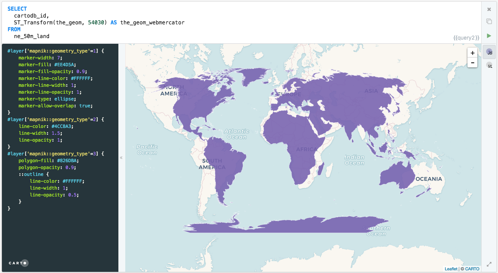

_About [working with different projections in CARTO](http://cartodb.github.io/training/intermediate/cartocss.html#projections) and [`ST_Transform`](http://postgis.net/docs/ST_Transform.html)._

_This [application](https://ramiroaznar.github.io/labs-carto-proj/) displays several popular map projections and gives some information on each._

***

### Translating Geometries

```sql
SELECT
  cartodb_id,
  ST_Transform(ST_Translate(the_geom,5.0,7.4), 3857) as the_geom_webmercator
FROM
  ne_50m_land
WHERE
 ST_Intersects(
   the_geom,
   ST_MakeEnvelope(-18.748169,27.571591,-13.342896,29.463514,4326)
 )
```
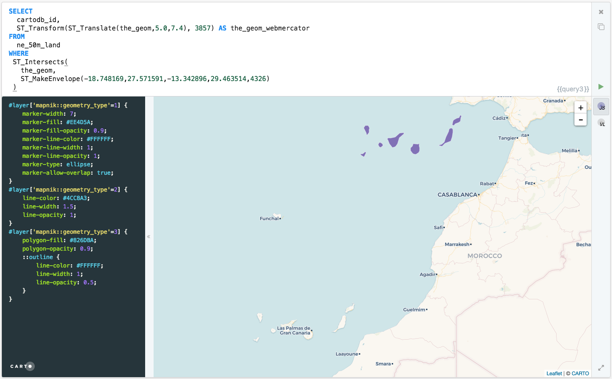

***

### Buffer (ST_Buffer)

#### Simple Buffer

ST_Buffer uses the input geometry's unit of measure, which in the case of our `the_geom` is decimal degrees. In order to use meters as our buffer unit, we must cast our geometry to a geography, then back to a geometry once we have our buffer. Alternatively, if you just want to visualize you can simply use `the_geom_webmercator`, as it's unit of measure is already meters.

_About [`ST_Buffer`](http://postgis.net/docs/ST_Buffer.html)._

```sql
SELECT
  ST_Transform(
    ST_Buffer(
      the_geom::geography,
      10000*5
    )::geometry,
  3857) As the_geom_webmercator,
  1 as cartodb_id
FROM
  ne_10m_populated_places_simple
WHERE
  adm0name ILIKE 'spain'
```
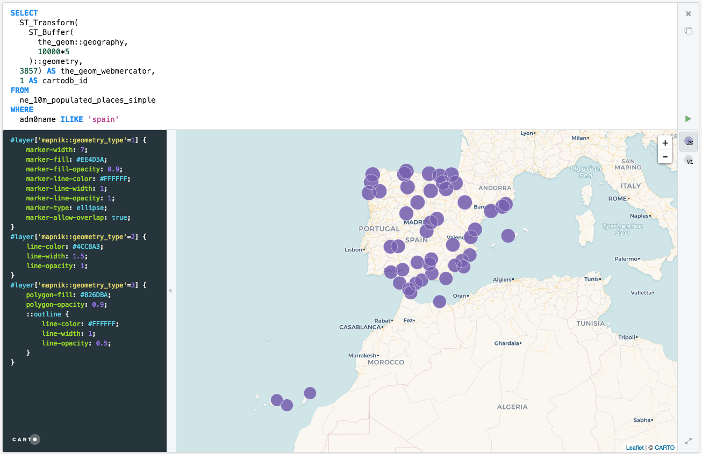

---

#### Dissolve Buffers
```sql
SELECT
  row_number() over() as cartodb_id,
  ST_UnaryUnion(grp) as the_geom,
  st_transform(
    ST_UnaryUnion(grp)
    ,3857
  ) as the_geom_webmercator,
  ST_NumGeometries(grp) as num_geoms
FROM
  (SELECT
    UNNEST(
      ST_ClusterWithin(
        (
          ST_BUFFER(
            (the_geom::geography)
            ,10000*5
          )::geometry
        )
      ,0.0001)
    ) AS grp
  FROM ne_10m_populated_places_simple
  WHERE adm0name ILIKE 'spain') sq
```
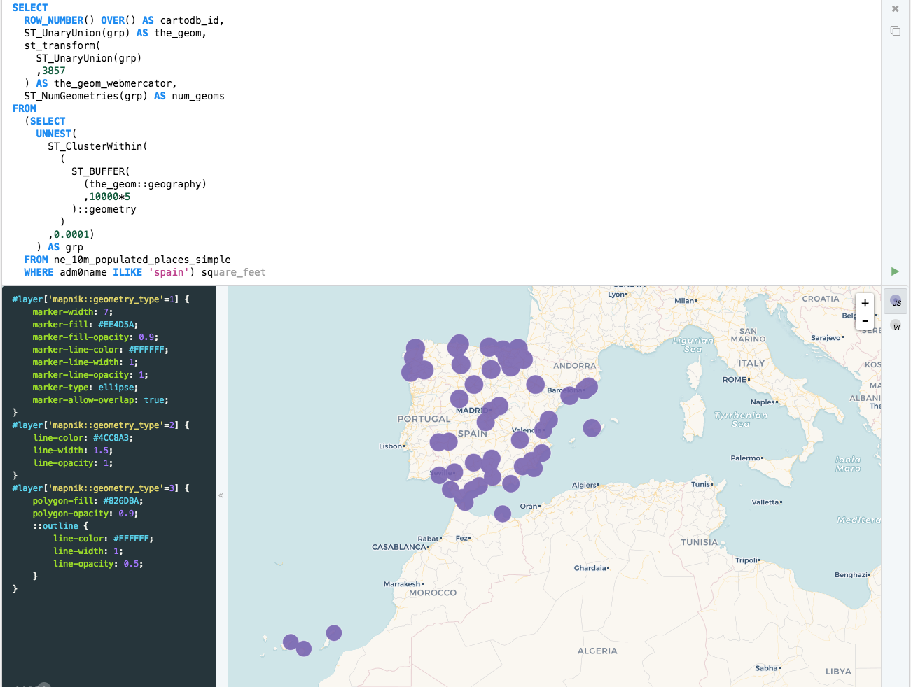

***

## SQL for Points
### Know wether a geometry is **within** the given range from another geometry:

```sql
SELECT a.*
  FROM ne_10m_populated_places_simple a,
       ne_10m_populated_places_simple b
 WHERE a.cartodb_id != b.cartodb_id
   AND ST_DWithin(
         a.the_geom_webmercator,
         b.the_geom_webmercator,
         150000)
   AND a.adm0name = 'Spain'
   AND b.adm0name = 'Spain'
```


In this case, we are using `the_geom_webmercator` to avoid casting to `geography` type. Calculations made with `geometry` type takes the CRS units.

Keep in mind that CRS **units in webmercator are not meters**, and they depend directly on the latitude.

_About [`ST_DWithin`](http://postgis.net/docs/ST_DWithin.html)._

***

### Making lines<a name="lines"></a>

#### Simple lines

```sql
WITH
  b as (SELECT * FROM ne_10m_populated_places_simple WHERE name ilike 'barcelona' and adm0name ilike 'spain'),
  m as (SELECT * FROM ne_10m_populated_places_simple WHERE name ilike 'madrid')

SELECT
  ST_Transform(ST_MakeLine(b.the_geom, m.the_geom),3857) as the_geom_webmercator,
  b.cartodb_id
FROM
  b, m
```


---

#### Multiple lines

```sql
WITH
  spain as (SELECT * FROM ne_10m_populated_places_simple WHERE adm0name ILIKE 'spain'),
  madrid as (SELECT * FROM spain WHERE name ILIKE 'Madrid')

SELECT
  ST_Transform(ST_MakeLine(m.the_geom, s.the_geom),3857) as the_geom_webmercator,
  s.cartodb_id
FROM
  spain s, madrid m
WHERE
  s.cartodb_id <> m.cartodb_id
```

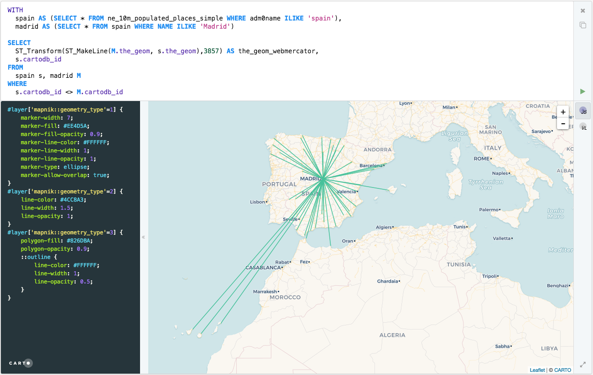

---

#### Sequential lines

```sql
SELECT
  ST_MakeLine(the_geom_webmercator ORDER BY ST_X(the_geom), ST_Y(the_geom) ASC) as the_geom_webmercator,
  min(cartodb_id) as cartodb_id
FROM
  ne_10m_populated_places_simple
WHERE
  adm0name ILIKE 'spain'
```

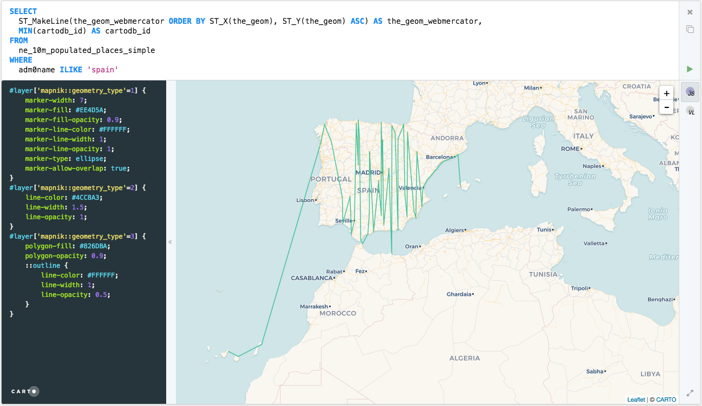
---
#### Great Circles (curved lines)

```sql
 SELECT ST_Transform(
          ST_Segmentize(
            ST_Makeline(
              a.the_geom,
              b.the_geom
            )::geography,
            100000
          )::geometry,
        3857
        ) as the_geom_webmercator
   FROM (
          SELECT *
            FROM ne_10m_populated_places_simple
           WHERE name ILIKE 'madrid'
        ) as a,
        (
          SELECT *
            FROM ne_10m_populated_places_simple
           WHERE name ILIKE 'new york'
        ) as b
```
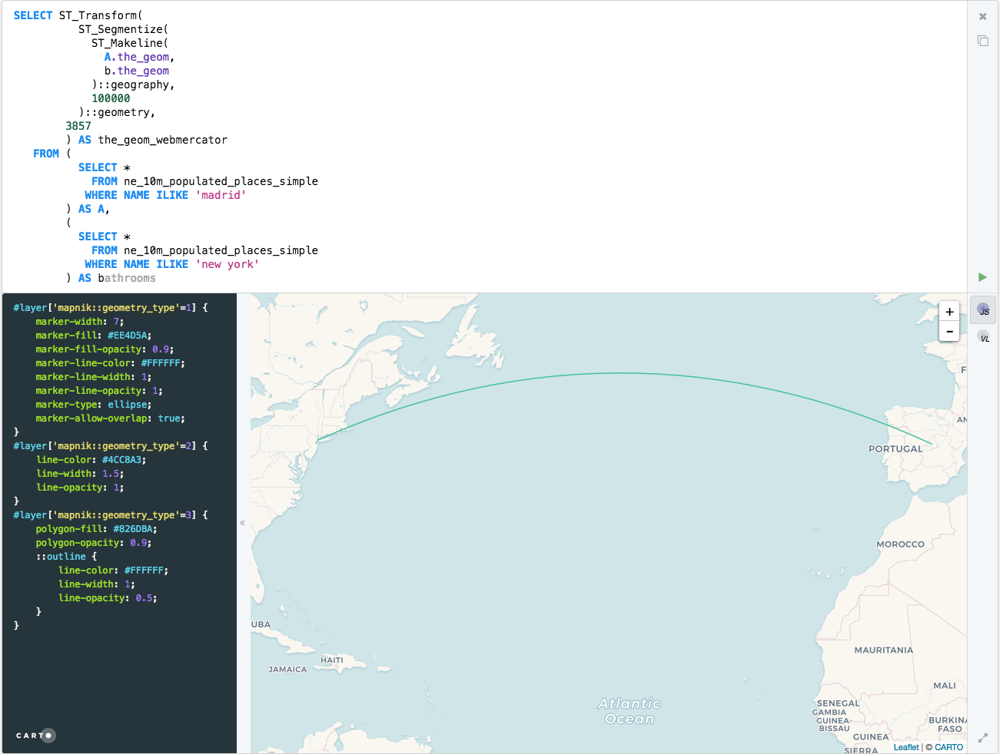

_About [Great Circles](http://blog.cartodb.com/jets-and-datelines/)._

***

## SQL for Polygons

### Get the number of points inside a polygon

Using `GROUP BY`:

```sql
  SELECT e.cartodb_id,
         e.admin,
         e.the_geom_webmercator,
         count(*) AS pp_count,
         sum(p.pop_max) as sum_pop
    FROM ne_adm0_europe e
    JOIN ne_10m_populated_places_simple p
      ON ST_Intersects(p.the_geom, e.the_geom)
GROUP BY e.cartodb_id
```
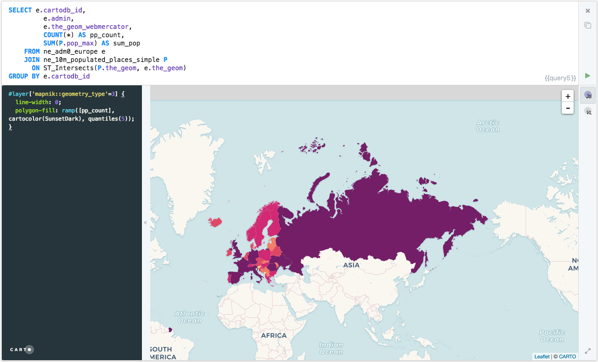
Using `LATERAL`:

```sql
SELECT a.cartodb_id,
       a.admin AS name,
       a.the_geom_webmercator,
       counts.number_cities AS pp_count,
       counts.sum_pop
  FROM ne_adm0_europe a
 CROSS JOIN LATERAL
  ( SELECT count(*) as number_cities,
           sum(pop_max) as sum_pop
      FROM ne_10m_populated_places_simple b
     WHERE ST_Intersects(a.the_geom, b.the_geom)
  ) AS counts
```
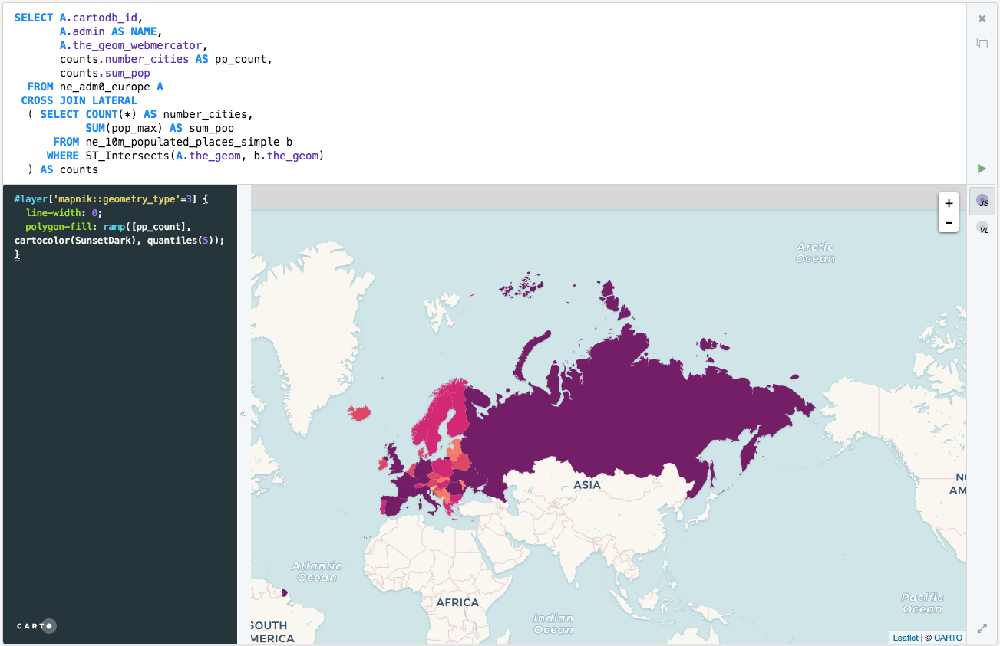

_About [`ST_Intersects`](http://postgis.net/docs/ST_Intersects.html) and [Lateral JOIN](http://blog.heapanalytics.com/postgresqls-powerful-new-join-type-lateral)_

**Note:** You know about the `EXPLAIN ANALYZE` function? use it to take a look on how both queries are pretty similar in terms of performance.

***

### Get the **difference** between two geometries:

```sql
SELECT a.cartodb_id,
       ST_Difference(
         a.the_geom_webmercator,
         b.the_geom_webmercator
       ) AS the_geom_webmercator
  FROM ne_50m_land a,
       ne_adm0_europe b
 WHERE b.adm0_a3 like 'ESP'
```
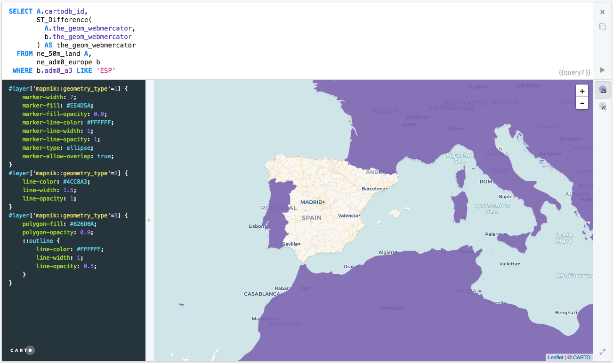

_About [`ST_Difference`](http://postgis.net/docs/ST_Difference.html)._

***

### Negative buffer

```sql
SELECT
  cartodb_id,
  ST_Transform(
    ST_Buffer(
      the_geom::geography,
      -30000
    )::geometry,
  3857) As the_geom_webmercator
FROM
  world_borders
WHERE
  name ilike 'spain'
```

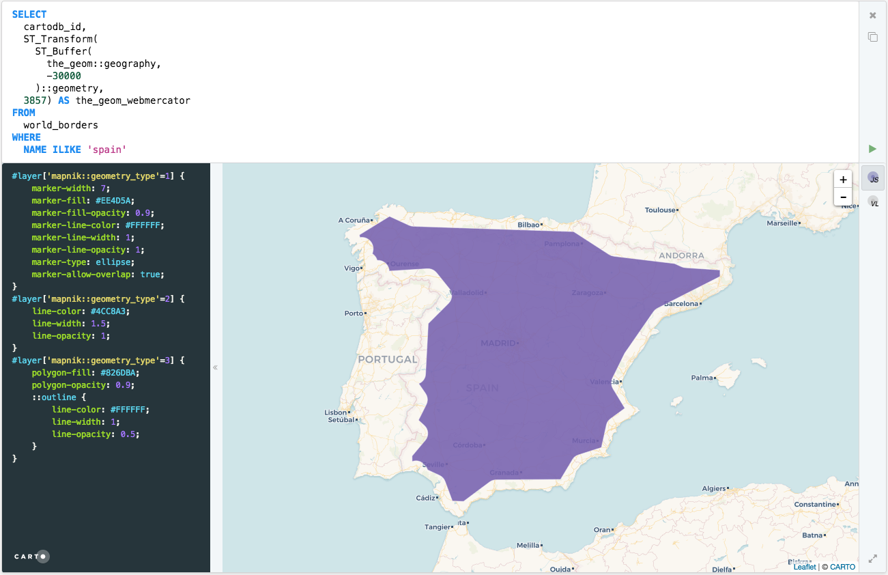

***

### Spatial Joins

```sql
with metro_lines as (
  SELECT
    row_number() over() as cartodb_id,
    ST_Buffer(
        the_geom::geography,
        100
      )::geometry as the_geom,
    ST_Transform(
      ST_Buffer(
        the_geom::geography,
        100
      )::geometry,
    3857) As the_geom_webmercator
  FROM lineas_madrid
  )

select x.*,
y.cartodb_id as joined
from listings_madrid x
left join metro_lines y
on st_intersects(x.the_geom, y.the_geom)
```
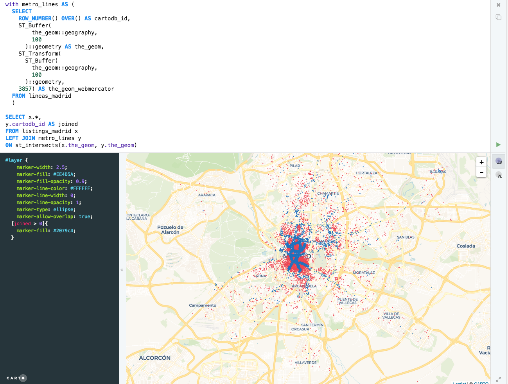

In the above example, you can see where the points joined on the buffer of the metro lines, and where they didn't based on if the cartodb_id for the lines existed in the points dataset.

***

## SQL for CARTO

### CDB_LatLng()

`cdb_latlng()` is a shortcut to the function `ST_SetSRID(ST_Point(),srid)`, with the default srid set as `4326`, the srid of `the_geom`. One notable difference is that `ST_Point()` takes coordinate pairs in the order of `(longitude, latitude)`, whereas `cdb_latlng()` takes coordinate pairs in the order of `(latitude, longitude)`.

```sql
SELECT
  1 as cartodb_id,
  CDB_LatLng(0,0) as the_geom,
  ST_Transform(CDB_LatLng(0, 0), 3857) as the_geom_webmercator  
  /* ST_SetSRID(ST_MakePoint(0, 0), 4326) */
```
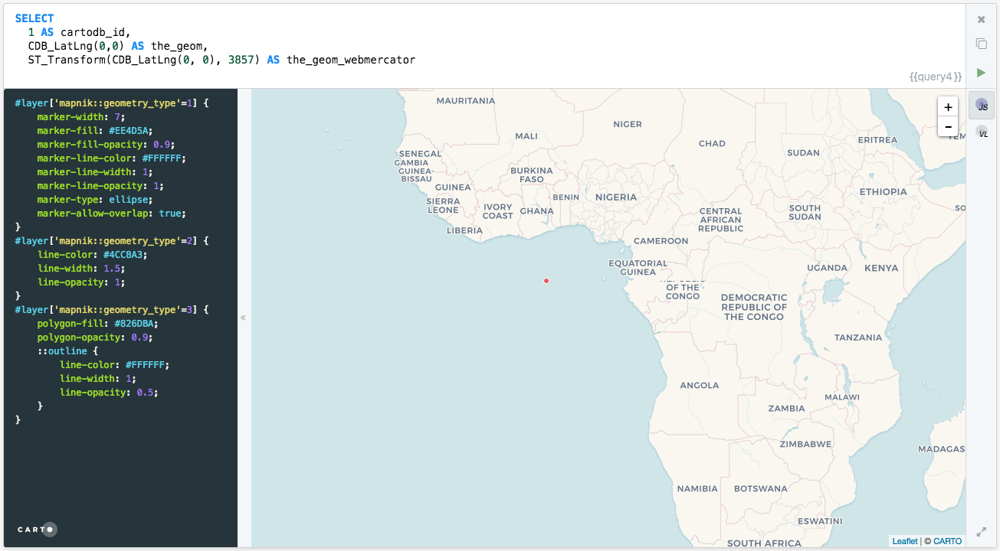

***

### Grids

#### Hexagon Grids

```sql
WITH grid as (
  SELECT
    row_number() over () as cartodb_id,
    CDB_HexagonGrid(
      ST_Buffer(the_geom_webmercator, 1000000),
      10000
    ) AS the_geom_webmercator
  FROM
    world_borders
  WHERE
    name ILIKE 'spain')

SELECT
  grid.the_geom_webmercator,
  grid.cartodb_id
FROM
  grid, world_borders a
WHERE
  ST_Intersects(grid.the_geom_webmercator, a.the_geom_webmercator)
AND
  name ILIKE 'spain'
```

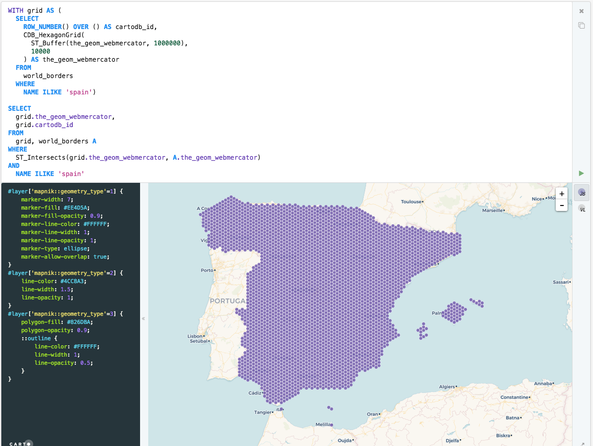

_About [CDB_HexagonGrid](http://docs.cartodb.com/tips-and-tricks/cartodb-functions/#a-hexagon-grid)_

---

#### Rectangular Grids

```sql
WITH grid as (
  SELECT
    row_number() over () as cartodb_id,
    CDB_RectangleGrid(
      ST_Buffer(the_geom_webmercator, 1000000),
      25000,
      25000
    ) AS the_geom_webmercator
  FROM
    world_borders
  WHERE
    name ILIKE 'spain')

SELECT
  grid.the_geom_webmercator,
  grid.cartodb_id
FROM
  grid, world_borders a
WHERE
  ST_Intersects(grid.the_geom_webmercator, a.the_geom_webmercator)
AND
  name ILIKE 'spain'
```
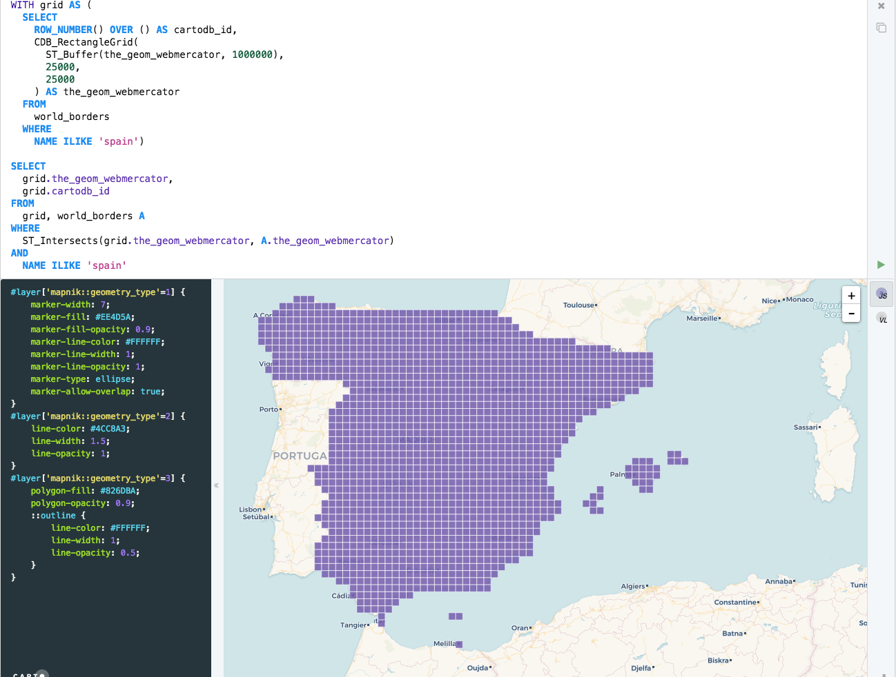
_About [CDB_RectangleGrid](http://docs.cartodb.com/tips-and-tricks/cartodb-functions/#a-rectangle-grid)_

You can read more about CARTO custom spatial queries [here](https://carto.com/docs/tips-and-tricks/carto-functions/).
